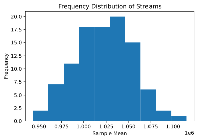
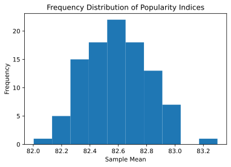
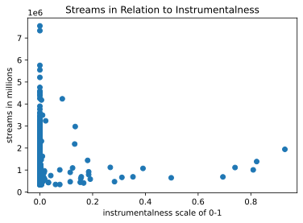
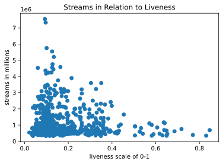

# Analyzing the Data of the Spotify Regional Top 200 Song Charts to Predict Success

By Amanuel Awoke, Ferzam Mohammad, and Josue Velasquez


[Image from The Guardian](https://www.theguardian.com/music/2020/mar/19/musicians-ask-spotify-to-triple-payments-to-cover-lost-concert-revenue)

# Introduction
## Motivation
The music industry has changed a lot in the last decade with the introduction of streaming services like Apple Music or Spotify. Services like Spotify allow users to livestream music for personal consumption, often for free or for a subscription fee. These services have made it easier to consume music and have increased opportunities for people to start producing music, but they have also changed how musicians make money. Whenever a user listens to a song on a streaming service, the service typically keeps track of the number of “streams” that song has. Music artists are then paid a small amount based on the number of streams they have accumulated for their music. Given how little these artists are paid from streaming services, maximizing the amount of revenue made from a song is valuable for those looking to push out music to these services. Play count also indicates where a song stands in the streaming services’ popularity lists, and making it onto their top 100 or 200 songs is a factor considered in whether these songs are added to global, official top songs charts i.e. Billboard 200.
 
Our group thought it would be interesting to see if we could try to make predictions for how popular a song might be given different features for a song (e.g. the genre of the song, how fast or slow it is, the key the song is written in, the time of year a song was released, how many listeners an artist already gets on average, etc.). If we can indicate how many plays a song will get, we can give a prediction for how much money a song will make on a streaming service. Much like the Moneyball scenario, it’s possible that artists are focusing on producing music that meets criteria which they think makes a song popular when, in reality, they should be focusing on other aspects of their music. Understanding what components of a song make it popular would help artists figure out the best way to produce music in order to make money off of these streaming services.

The Moneyball story demonstrated the importance of data science in producing a strong baseball team, and while music is different from sports, our project should hopefully reflect similar data science practices in order to reach a valuable conclusion. It may be relatively straightforward to look at aspects like which properties make the most money or whether a song by Taylor Swift will end up on the top 200 chart given her “incredibly loyal fanbase” of over 40 million people, but maybe there are other similarities between popular songs that could indicate factors which help make a song more popular. Data science practices help us here by giving us tools to help identify characteristics in a song, clarify how those characteristics might relate to stream count, and may give insight on what areas should be focused on when producing music.

From this point forward when we use the word "track" it is synonymous with "song."

## Goal Hypothesis
Are there traits of a song that can be used to determine future success? If so, what are they?
## Defining Success
We are defining the success of a track by its appearance on the Top 200, as well as its ranking on the Top 200 (the higher the better).


# Collect Data

This is the first step in the data lifecycle where we must identify information to web scrape. We gather data from the [Spotify Charts Regional Top 200](https://spotifycharts.com/regional) to first identify which songs had the highest stream counts in the United States, dating back to January 1st 2017, to current day. Spotify Charts provides tracks with the highest stream count, their top 200 rank, and the artist(s) who created that song. Spotify Charts already compiles the data into Excel tables, so it isn't necessary to directly scrape from the website. If you wanted to download one yourself, at the top right of the website, select a date you'd like to download in the dropdown, then select further up "Download to CSV." The pandas method read_csv() was used to process the Excel files into dataframes.


```python
import os
import pandas as pd
import requests
from bs4 import BeautifulSoup
import spotipy
import numpy as np
import matplotlib.pyplot as plt
import seaborn as sns
```

Since there were consistent download URLs of Excel sheets in relation to the date they recorded, we used a looped to retreive the links then later download all sheets.


```python
# Collect links from spotify charts top 200 streams per day
ref_str = "https://spotifycharts.com/regional/global/daily/"
ref_arr = []


for year in range(2017, 2018):
    date = ""
    
    endingMonth = 12
    if year == 2020:
        endingMonth = 10
        
    for month in range (1, endingMonth + 1):
       
        dayCount = -1

        #gets proper day count per month
        thirtyDayCountMonths = [4, 6, 9, 11]
        if month == 2:
            dayCount = 29
        elif month in thirtyDayCountMonths:
            dayCount = 30
        else:
            dayCount = 31

        if int(month) < 10:
            month = "0" + str(month)
        #Get days if we want it
        # for day in range (1, daycount + 1):           
        #   if int(day) < 10:
        #     day = "0" + str(day)

        date = str(year) + "-" + str(month) + "-" + "01" + "/download"
        date = ref_str + date
        ref_arr.append(date)

ref_arr
```


    ['https://spotifycharts.com/regional/global/daily/2017-01-01/download',
     'https://spotifycharts.com/regional/global/daily/2017-02-01/download',
     'https://spotifycharts.com/regional/global/daily/2017-03-01/download',
     'https://spotifycharts.com/regional/global/daily/2017-04-01/download',
     'https://spotifycharts.com/regional/global/daily/2017-05-01/download',
     'https://spotifycharts.com/regional/global/daily/2017-06-01/download',
     'https://spotifycharts.com/regional/global/daily/2017-07-01/download',
     'https://spotifycharts.com/regional/global/daily/2017-08-01/download',
     'https://spotifycharts.com/regional/global/daily/2017-09-01/download',
     'https://spotifycharts.com/regional/global/daily/2017-10-01/download',
     'https://spotifycharts.com/regional/global/daily/2017-11-01/download',
     'https://spotifycharts.com/regional/global/daily/2017-12-01/download']


```python
#Loop downloading and appending of dataframes 

df = pd.DataFrame(columns =['position', 'track_name', 'artist', 'streams', 'url', 'date'] )
#make dir to save to
path = "sheets"
folderExists = False
try:
    os.mkdir(path)
except FileExistsError:
    print ("Folder already exists")
    folderExists = True

for i in ref_arr:

    r = requests.get(i, allow_redirects = True)
    #String manipulation to read from the correct csv files
    date = i[48:58]
    fileName = "regional-global-daily-" + date + ".csv"
    if not folderExists:
        print("Downloading... " + fileName)
        open(fileName, "wb").write(r.content)

        os.rename(fileName, "sheets/" + fileName)

    df_new = pd.read_csv(path + "/" + fileName)
    df_new.columns= ['position', 'track_name', 'artist', 'streams', 'url']
    df_new['date'] = date
    
    df_new = df_new.iloc[1:] #deletes junk row from csv conversion
    df = df.append(df_new)

print("Done")
df = df.reset_index() # Sets index back to being the regular 0-based index. This is really helpful when trying to add more to the dataframe later, because otherwise there are lots of duplicate indices
df['streams'] = df['streams'].astype(int) #streams are a string of a num, must wrap as type int always
```

    Folder already exists
    Done
    

## Wrangled data into dataframe


```python
df
```


<div>
<style scoped>
    .dataframe tbody tr th:only-of-type {
        vertical-align: middle;
    }

    .dataframe tbody tr th {
        vertical-align: top;
    }

    .dataframe thead th {
        text-align: right;
    }
</style>
<table border="1" class="dataframe">
  <thead>
    <tr style="text-align: right;">
      <th></th>
      <th>index</th>
      <th>position</th>
      <th>track_name</th>
      <th>artist</th>
      <th>streams</th>
      <th>url</th>
      <th>date</th>
    </tr>
  </thead>
  <tbody>
    <tr>
      <th>0</th>
      <td>1</td>
      <td>1</td>
      <td>Starboy</td>
      <td>The Weeknd</td>
      <td>3135625</td>
      <td>https://open.spotify.com/track/5aAx2yezTd8zXrk...</td>
      <td>2017-01-01</td>
    </tr>
    <tr>
      <th>1</th>
      <td>2</td>
      <td>2</td>
      <td>Closer</td>
      <td>The Chainsmokers</td>
      <td>3015525</td>
      <td>https://open.spotify.com/track/7BKLCZ1jbUBVqRi...</td>
      <td>2017-01-01</td>
    </tr>
    <tr>
      <th>2</th>
      <td>3</td>
      <td>3</td>
      <td>Let Me Love You</td>
      <td>DJ Snake</td>
      <td>2545384</td>
      <td>https://open.spotify.com/track/4pdPtRcBmOSQDlJ...</td>
      <td>2017-01-01</td>
    </tr>
    <tr>
      <th>3</th>
      <td>4</td>
      <td>4</td>
      <td>Rockabye (feat. Sean Paul &amp; Anne-Marie)</td>
      <td>Clean Bandit</td>
      <td>2356604</td>
      <td>https://open.spotify.com/track/5knuzwU65gJK7IF...</td>
      <td>2017-01-01</td>
    </tr>
    <tr>
      <th>4</th>
      <td>5</td>
      <td>5</td>
      <td>One Dance</td>
      <td>Drake</td>
      <td>2259887</td>
      <td>https://open.spotify.com/track/1xznGGDReH1oQq0...</td>
      <td>2017-01-01</td>
    </tr>
    <tr>
      <th>...</th>
      <td>...</td>
      <td>...</td>
      <td>...</td>
      <td>...</td>
      <td>...</td>
      <td>...</td>
      <td>...</td>
    </tr>
    <tr>
      <th>2395</th>
      <td>196</td>
      <td>196</td>
      <td>Rockabye (feat. Sean Paul &amp; Anne-Marie)</td>
      <td>Clean Bandit</td>
      <td>552118</td>
      <td>https://open.spotify.com/track/5knuzwU65gJK7IF...</td>
      <td>2017-12-01</td>
    </tr>
    <tr>
      <th>2396</th>
      <td>197</td>
      <td>197</td>
      <td>Rake It Up (feat. Nicki Minaj)</td>
      <td>Yo Gotti</td>
      <td>551576</td>
      <td>https://open.spotify.com/track/4knL4iPxPOZjQzT...</td>
      <td>2017-12-01</td>
    </tr>
    <tr>
      <th>2397</th>
      <td>198</td>
      <td>198</td>
      <td>New Freezer (feat. Kendrick Lamar)</td>
      <td>Rich The Kid</td>
      <td>550167</td>
      <td>https://open.spotify.com/track/4pYZLpX23Vx8rwD...</td>
      <td>2017-12-01</td>
    </tr>
    <tr>
      <th>2398</th>
      <td>199</td>
      <td>199</td>
      <td>All Night</td>
      <td>Steve Aoki</td>
      <td>548039</td>
      <td>https://open.spotify.com/track/5mAxA6Q1SIym6dP...</td>
      <td>2017-12-01</td>
    </tr>
    <tr>
      <th>2399</th>
      <td>200</td>
      <td>200</td>
      <td>113</td>
      <td>Booba</td>
      <td>546878</td>
      <td>https://open.spotify.com/track/6xqAP7kpdgCy8lE...</td>
      <td>2017-12-01</td>
    </tr>
  </tbody>
</table>
<p>2400 rows × 7 columns</p>
</div>


# Data Processing

[Spotipy](https://spotipy.readthedocs.io/en/2.16.1/#) is a lightweight Python library for the [Spotify Web API](https://developer.spotify.com/documentation/web-api/) used to retrieve more detailed data for tracks now that their names have been retrieved from the Spotify Top 200. We must first authenticate our usage of the API.


```python
import spotipy
from spotipy.oauth2 import SpotifyOAuth
from spotipy.oauth2 import SpotifyClientCredentials


SPOTIPY_CLIENT_ID="ea1a162fbc6f413990542b76ab82a168"
SPOTIPY_CLIENT_SECRET="a09882042ce54f158fdd2b6baaf2b26d"
SPOTIPY_CLIENT_REDIRECT="http://www.cs.umd.edu/class/fall2020/cmsc320-0201/"

scope = "user-library-read"

sp = spotipy.Spotify(auth_manager=SpotifyOAuth(scope=scope, client_id=SPOTIPY_CLIENT_ID, client_secret=SPOTIPY_CLIENT_SECRET, redirect_uri=SPOTIPY_CLIENT_REDIRECT))


```

We're going to start by using the Spotify API to get more information about all the tracks we found in the top 200's chart for the timeframe we described above. The Spotify API gives us the ability to get "audio features" from a song given a track id that Spotify creates for every song. These "audio features" include characteristics like loudness, positivity, danceability, how energetic the song is, the speed of the song, and a couple other similar characteristics that have been determined by Spotify using their own machine learning algorithms.

First, we do need to get an id for every song and artist in our dataframe to be able to make queries through the Spotify API for a specific track or artist. Here, we get track and artist ids, and we also make a query for the audio features of each track id. We're doing these together for code efficiency, just because a large number of queries through the Spotify API can take time. For testing we cached the dataframe rather than compiling the data every time.


```python
import xlsxwriter
import openpyxl

artist_id_list = []
track_id_list = []
popularity_index_list = []
follower_count_list = []
audio_features_df = pd.DataFrame()

genre_list = []
genre_filter = ["rap", "pop", "edm", "rock", "other"]


#if cached df exists dont search again, else search again
if not os.path.exists("cached_df.xlsx"):
    #Take each song and lookup its audio features, then create a dataframe for them
    print("Searching...")
    for index, row in df.iterrows():
        trackName = row['track_name']
        track_id = ""
        artist_id = ""
        # We need to check if our track_name received was a nan value. Idk how these got in here, but there are nans
        if(type(trackName) == str):
            #delimit with +'s for spotipy search query
            trackNameWithoutSpaces = '+'.join(trackName.split())
            searchQuery = sp.search(trackNameWithoutSpaces, 1, 0)
            if (len(searchQuery['tracks']['items']) != 0):
                
                track_object = searchQuery['tracks']['items'][0]
                track_id = track_object['id']
                track_id_list.append(track_id)

                #if there are several artists, return the first artist
                artist_object = track_object['artists'][0] if type(track_object['artists']) is list else track_object['artists']
                artist_id = artist_object['id']
                artist_id_list.append(artist_id)

    
                artist_object_real = sp.artist(artist_id)
                # print(artist_object_real)
                followers_object = artist_object_real['followers']
                followers_value = followers_object['total']
                follower_count_list.append(followers_value)
                popularity_value = artist_object_real['popularity']
                popularity_index_list.append(popularity_value)

                # if artist_object_real['genres']
                    # genre_value = "Rap"
                # genre_list.append(genre_value)
                # print(genre_list)


                # print(popularity_index_list)


            # If our query returned nothing then append a nan in the place of artist and track for this entry
            else:
                artist_id_list.append(np.nan)
                track_id_list.append(np.nan)
                
                popularity_index_list.append(np.nan)
                follower_count_list.append(np.nan)

                genre_list.append(np.nan)
        # If we had stored a nan, then just plan to append a nan in this position
        else:
            artist_id_list.append(np.nan)
            track_id_list.append(np.nan)
            
            popularity_index_list.append(np.nan)
            follower_count_list.append(np.nan)

            genre_list.append(np.nan)

       
        #Defining audio features as nan to begin    
        audiofeatures = {'duration_ms' : np.nan, 'key' : np.nan, 'mode' : np.nan, 'time_signature' : np.nan, 'acousticness' : np.nan, 'danceability' : np.nan, 'energy' : np.nan, 'instrumentalness' : np.nan, 'liveness' : np.nan, 'loudness' : np.nan, 'speechiness' : np.nan, 'valence' : np.nan, 'tempo' : np.nan, 'id' : np.nan, 'uri' : np.nan, 'track_href' : np.nan, 'analysis_url' : np.nan, 'type' : np.nan, }

        # If we successfully found a track when we did our search, then get the audio features for that
        if (track_id != ""):
            audiofeatures = sp.audio_features(track_id)[0]
        #Append the audio features
        audio_features_df = audio_features_df.append(audiofeatures, ignore_index=True)

    #adds artist id list 
    audio_features_df['artist_id'] = artist_id_list 
    audio_features_df['popularity_index'] = popularity_index_list
    audio_features_df['follower_count'] = follower_count_list

    # audio_features_df['genre'] = genre_list

    # Store the created data frame into the cache
    writer = pd.ExcelWriter('cached_df.xlsx', engine='openpyxl')
    audio_features_df.to_excel(writer, sheet_name='Sheet1')
    writer.save()
    
else: #access the cached df if it exist
 
    print("Cached dataframe found.")
    audio_features_df = pd.read_excel("cached_df.xlsx", engine = "openpyxl")
    audio_features_df.drop(["Unnamed: 0"], axis=1, inplace=True) #delete position row since rank alraedy has this information

audio_features_df
```

    Cached dataframe found.
    


<div>
<style scoped>
    .dataframe tbody tr th:only-of-type {
        vertical-align: middle;
    }

    .dataframe tbody tr th {
        vertical-align: top;
    }

    .dataframe thead th {
        text-align: right;
    }
</style>
<table border="1" class="dataframe">
  <thead>
    <tr style="text-align: right;">
      <th></th>
      <th>acousticness</th>
      <th>analysis_url</th>
      <th>danceability</th>
      <th>duration_ms</th>
      <th>energy</th>
      <th>id</th>
      <th>instrumentalness</th>
      <th>key</th>
      <th>liveness</th>
      <th>loudness</th>
      <th>...</th>
      <th>speechiness</th>
      <th>tempo</th>
      <th>time_signature</th>
      <th>track_href</th>
      <th>type</th>
      <th>uri</th>
      <th>valence</th>
      <th>artist_id</th>
      <th>popularity_index</th>
      <th>follower_count</th>
    </tr>
  </thead>
  <tbody>
    <tr>
      <th>0</th>
      <td>0.14100</td>
      <td>https://api.spotify.com/v1/audio-analysis/7MXV...</td>
      <td>0.679</td>
      <td>230453.0</td>
      <td>0.587</td>
      <td>7MXVkk9YMctZqd1Srtv4MB</td>
      <td>0.000006</td>
      <td>7.0</td>
      <td>0.137</td>
      <td>-7.015</td>
      <td>...</td>
      <td>0.2760</td>
      <td>186.003</td>
      <td>4.0</td>
      <td>https://api.spotify.com/v1/tracks/7MXVkk9YMctZ...</td>
      <td>audio_features</td>
      <td>spotify:track:7MXVkk9YMctZqd1Srtv4MB</td>
      <td>0.486</td>
      <td>1Xyo4u8uXC1ZmMpatF05PJ</td>
      <td>94.0</td>
      <td>26720759.0</td>
    </tr>
    <tr>
      <th>1</th>
      <td>0.41400</td>
      <td>https://api.spotify.com/v1/audio-analysis/7BKL...</td>
      <td>0.748</td>
      <td>244960.0</td>
      <td>0.524</td>
      <td>7BKLCZ1jbUBVqRi2FVlTVw</td>
      <td>0.000000</td>
      <td>8.0</td>
      <td>0.111</td>
      <td>-5.599</td>
      <td>...</td>
      <td>0.0338</td>
      <td>95.010</td>
      <td>4.0</td>
      <td>https://api.spotify.com/v1/tracks/7BKLCZ1jbUBV...</td>
      <td>audio_features</td>
      <td>spotify:track:7BKLCZ1jbUBVqRi2FVlTVw</td>
      <td>0.661</td>
      <td>69GGBxA162lTqCwzJG5jLp</td>
      <td>84.0</td>
      <td>17093912.0</td>
    </tr>
    <tr>
      <th>2</th>
      <td>0.23500</td>
      <td>https://api.spotify.com/v1/audio-analysis/3ibK...</td>
      <td>0.656</td>
      <td>256733.0</td>
      <td>0.578</td>
      <td>3ibKnFDaa3GhpPGlOUj7ff</td>
      <td>0.000000</td>
      <td>7.0</td>
      <td>0.118</td>
      <td>-8.970</td>
      <td>...</td>
      <td>0.0922</td>
      <td>94.514</td>
      <td>4.0</td>
      <td>https://api.spotify.com/v1/tracks/3ibKnFDaa3Gh...</td>
      <td>audio_features</td>
      <td>spotify:track:3ibKnFDaa3GhpPGlOUj7ff</td>
      <td>0.556</td>
      <td>20s0P9QLxGqKuCsGwFsp7w</td>
      <td>69.0</td>
      <td>2055274.0</td>
    </tr>
    <tr>
      <th>3</th>
      <td>0.40600</td>
      <td>https://api.spotify.com/v1/audio-analysis/5knu...</td>
      <td>0.720</td>
      <td>251088.0</td>
      <td>0.763</td>
      <td>5knuzwU65gJK7IF5yJsuaW</td>
      <td>0.000000</td>
      <td>9.0</td>
      <td>0.180</td>
      <td>-4.068</td>
      <td>...</td>
      <td>0.0523</td>
      <td>101.965</td>
      <td>4.0</td>
      <td>https://api.spotify.com/v1/tracks/5knuzwU65gJK...</td>
      <td>audio_features</td>
      <td>spotify:track:5knuzwU65gJK7IF5yJsuaW</td>
      <td>0.742</td>
      <td>6MDME20pz9RveH9rEXvrOM</td>
      <td>80.0</td>
      <td>4092589.0</td>
    </tr>
    <tr>
      <th>4</th>
      <td>0.00776</td>
      <td>https://api.spotify.com/v1/audio-analysis/1zi7...</td>
      <td>0.792</td>
      <td>173987.0</td>
      <td>0.625</td>
      <td>1zi7xx7UVEFkmKfv06H8x0</td>
      <td>0.001800</td>
      <td>1.0</td>
      <td>0.329</td>
      <td>-5.609</td>
      <td>...</td>
      <td>0.0536</td>
      <td>103.967</td>
      <td>4.0</td>
      <td>https://api.spotify.com/v1/tracks/1zi7xx7UVEFk...</td>
      <td>audio_features</td>
      <td>spotify:track:1zi7xx7UVEFkmKfv06H8x0</td>
      <td>0.370</td>
      <td>3TVXtAsR1Inumwj472S9r4</td>
      <td>96.0</td>
      <td>51374698.0</td>
    </tr>
    <tr>
      <th>...</th>
      <td>...</td>
      <td>...</td>
      <td>...</td>
      <td>...</td>
      <td>...</td>
      <td>...</td>
      <td>...</td>
      <td>...</td>
      <td>...</td>
      <td>...</td>
      <td>...</td>
      <td>...</td>
      <td>...</td>
      <td>...</td>
      <td>...</td>
      <td>...</td>
      <td>...</td>
      <td>...</td>
      <td>...</td>
      <td>...</td>
      <td>...</td>
    </tr>
    <tr>
      <th>2395</th>
      <td>0.40600</td>
      <td>https://api.spotify.com/v1/audio-analysis/5knu...</td>
      <td>0.720</td>
      <td>251088.0</td>
      <td>0.763</td>
      <td>5knuzwU65gJK7IF5yJsuaW</td>
      <td>0.000000</td>
      <td>9.0</td>
      <td>0.180</td>
      <td>-4.068</td>
      <td>...</td>
      <td>0.0523</td>
      <td>101.965</td>
      <td>4.0</td>
      <td>https://api.spotify.com/v1/tracks/5knuzwU65gJK...</td>
      <td>audio_features</td>
      <td>spotify:track:5knuzwU65gJK7IF5yJsuaW</td>
      <td>0.742</td>
      <td>6MDME20pz9RveH9rEXvrOM</td>
      <td>80.0</td>
      <td>4092589.0</td>
    </tr>
    <tr>
      <th>2396</th>
      <td>0.02200</td>
      <td>https://api.spotify.com/v1/audio-analysis/4knL...</td>
      <td>0.910</td>
      <td>276333.0</td>
      <td>0.444</td>
      <td>4knL4iPxPOZjQzTUlELGSY</td>
      <td>0.000000</td>
      <td>1.0</td>
      <td>0.137</td>
      <td>-8.126</td>
      <td>...</td>
      <td>0.3440</td>
      <td>149.953</td>
      <td>4.0</td>
      <td>https://api.spotify.com/v1/tracks/4knL4iPxPOZj...</td>
      <td>audio_features</td>
      <td>spotify:track:4knL4iPxPOZjQzTUlELGSY</td>
      <td>0.530</td>
      <td>6Ha4aES39QiVjR0L2lwuwq</td>
      <td>75.0</td>
      <td>3109571.0</td>
    </tr>
    <tr>
      <th>2397</th>
      <td>0.04050</td>
      <td>https://api.spotify.com/v1/audio-analysis/2EgB...</td>
      <td>0.884</td>
      <td>191938.0</td>
      <td>0.698</td>
      <td>2EgB4n6XyBsuNUbuarr4eG</td>
      <td>0.000000</td>
      <td>0.0</td>
      <td>0.195</td>
      <td>-9.101</td>
      <td>...</td>
      <td>0.3640</td>
      <td>140.068</td>
      <td>4.0</td>
      <td>https://api.spotify.com/v1/tracks/2EgB4n6XyBsu...</td>
      <td>audio_features</td>
      <td>spotify:track:2EgB4n6XyBsuNUbuarr4eG</td>
      <td>0.575</td>
      <td>1pPmIToKXyGdsCF6LmqLmI</td>
      <td>78.0</td>
      <td>2419234.0</td>
    </tr>
    <tr>
      <th>2398</th>
      <td>0.00410</td>
      <td>https://api.spotify.com/v1/audio-analysis/0dXN...</td>
      <td>0.538</td>
      <td>197640.0</td>
      <td>0.804</td>
      <td>0dXNQ8dckG4eYfEtq9zcva</td>
      <td>0.000000</td>
      <td>8.0</td>
      <td>0.330</td>
      <td>-5.194</td>
      <td>...</td>
      <td>0.0358</td>
      <td>144.992</td>
      <td>4.0</td>
      <td>https://api.spotify.com/v1/tracks/0dXNQ8dckG4e...</td>
      <td>audio_features</td>
      <td>spotify:track:0dXNQ8dckG4eYfEtq9zcva</td>
      <td>0.507</td>
      <td>7gAppWoH7pcYmphCVTXkzs</td>
      <td>76.0</td>
      <td>4082406.0</td>
    </tr>
    <tr>
      <th>2399</th>
      <td>0.00805</td>
      <td>https://api.spotify.com/v1/audio-analysis/0leV...</td>
      <td>0.740</td>
      <td>266672.0</td>
      <td>0.510</td>
      <td>0leVyLipY7A8ruhkIBqc0E</td>
      <td>0.000375</td>
      <td>9.0</td>
      <td>0.128</td>
      <td>-8.042</td>
      <td>...</td>
      <td>0.0780</td>
      <td>141.534</td>
      <td>5.0</td>
      <td>https://api.spotify.com/v1/tracks/0leVyLipY7A8...</td>
      <td>audio_features</td>
      <td>spotify:track:0leVyLipY7A8ruhkIBqc0E</td>
      <td>0.089</td>
      <td>0JOxt5QOwq0czoJxvSc5hS</td>
      <td>70.0</td>
      <td>168927.0</td>
    </tr>
  </tbody>
</table>
<p>2400 rows × 21 columns</p>
</div>


```python

#Append audio features to master dataframe
df['track_id'] = audio_features_df['id']
df['duration_ms'] = audio_features_df['duration_ms']
df['acousticness'] = audio_features_df['acousticness']
df['danceability'] = audio_features_df['danceability']
df['energy'] = audio_features_df['energy']
df['instrumentalness'] = audio_features_df['instrumentalness']
df['liveness'] = audio_features_df['liveness']
df['loudness'] = audio_features_df['loudness']
df['speechiness'] = audio_features_df['speechiness']
df['valence'] = audio_features_df['valence']
df['tempo'] = audio_features_df['tempo']
df['artist_id'] = audio_features_df['artist_id']
df['popularity_index'] = audio_features_df['popularity_index']
df['follower_count'] = audio_features_df['follower_count']

df
```


<div>
<style scoped>
    .dataframe tbody tr th:only-of-type {
        vertical-align: middle;
    }

    .dataframe tbody tr th {
        vertical-align: top;
    }

    .dataframe thead th {
        text-align: right;
    }
</style>
<table border="1" class="dataframe">
  <thead>
    <tr style="text-align: right;">
      <th></th>
      <th>index</th>
      <th>position</th>
      <th>track_name</th>
      <th>artist</th>
      <th>streams</th>
      <th>url</th>
      <th>date</th>
      <th>track_id</th>
      <th>duration_ms</th>
      <th>acousticness</th>
      <th>...</th>
      <th>energy</th>
      <th>instrumentalness</th>
      <th>liveness</th>
      <th>loudness</th>
      <th>speechiness</th>
      <th>valence</th>
      <th>tempo</th>
      <th>artist_id</th>
      <th>popularity_index</th>
      <th>follower_count</th>
    </tr>
  </thead>
  <tbody>
    <tr>
      <th>0</th>
      <td>1</td>
      <td>1</td>
      <td>Starboy</td>
      <td>The Weeknd</td>
      <td>3135625</td>
      <td>https://open.spotify.com/track/5aAx2yezTd8zXrk...</td>
      <td>2017-01-01</td>
      <td>7MXVkk9YMctZqd1Srtv4MB</td>
      <td>230453.0</td>
      <td>0.14100</td>
      <td>...</td>
      <td>0.587</td>
      <td>0.000006</td>
      <td>0.137</td>
      <td>-7.015</td>
      <td>0.2760</td>
      <td>0.486</td>
      <td>186.003</td>
      <td>1Xyo4u8uXC1ZmMpatF05PJ</td>
      <td>94.0</td>
      <td>26720759.0</td>
    </tr>
    <tr>
      <th>1</th>
      <td>2</td>
      <td>2</td>
      <td>Closer</td>
      <td>The Chainsmokers</td>
      <td>3015525</td>
      <td>https://open.spotify.com/track/7BKLCZ1jbUBVqRi...</td>
      <td>2017-01-01</td>
      <td>7BKLCZ1jbUBVqRi2FVlTVw</td>
      <td>244960.0</td>
      <td>0.41400</td>
      <td>...</td>
      <td>0.524</td>
      <td>0.000000</td>
      <td>0.111</td>
      <td>-5.599</td>
      <td>0.0338</td>
      <td>0.661</td>
      <td>95.010</td>
      <td>69GGBxA162lTqCwzJG5jLp</td>
      <td>84.0</td>
      <td>17093912.0</td>
    </tr>
    <tr>
      <th>2</th>
      <td>3</td>
      <td>3</td>
      <td>Let Me Love You</td>
      <td>DJ Snake</td>
      <td>2545384</td>
      <td>https://open.spotify.com/track/4pdPtRcBmOSQDlJ...</td>
      <td>2017-01-01</td>
      <td>3ibKnFDaa3GhpPGlOUj7ff</td>
      <td>256733.0</td>
      <td>0.23500</td>
      <td>...</td>
      <td>0.578</td>
      <td>0.000000</td>
      <td>0.118</td>
      <td>-8.970</td>
      <td>0.0922</td>
      <td>0.556</td>
      <td>94.514</td>
      <td>20s0P9QLxGqKuCsGwFsp7w</td>
      <td>69.0</td>
      <td>2055274.0</td>
    </tr>
    <tr>
      <th>3</th>
      <td>4</td>
      <td>4</td>
      <td>Rockabye (feat. Sean Paul &amp; Anne-Marie)</td>
      <td>Clean Bandit</td>
      <td>2356604</td>
      <td>https://open.spotify.com/track/5knuzwU65gJK7IF...</td>
      <td>2017-01-01</td>
      <td>5knuzwU65gJK7IF5yJsuaW</td>
      <td>251088.0</td>
      <td>0.40600</td>
      <td>...</td>
      <td>0.763</td>
      <td>0.000000</td>
      <td>0.180</td>
      <td>-4.068</td>
      <td>0.0523</td>
      <td>0.742</td>
      <td>101.965</td>
      <td>6MDME20pz9RveH9rEXvrOM</td>
      <td>80.0</td>
      <td>4092589.0</td>
    </tr>
    <tr>
      <th>4</th>
      <td>5</td>
      <td>5</td>
      <td>One Dance</td>
      <td>Drake</td>
      <td>2259887</td>
      <td>https://open.spotify.com/track/1xznGGDReH1oQq0...</td>
      <td>2017-01-01</td>
      <td>1zi7xx7UVEFkmKfv06H8x0</td>
      <td>173987.0</td>
      <td>0.00776</td>
      <td>...</td>
      <td>0.625</td>
      <td>0.001800</td>
      <td>0.329</td>
      <td>-5.609</td>
      <td>0.0536</td>
      <td>0.370</td>
      <td>103.967</td>
      <td>3TVXtAsR1Inumwj472S9r4</td>
      <td>96.0</td>
      <td>51374698.0</td>
    </tr>
    <tr>
      <th>...</th>
      <td>...</td>
      <td>...</td>
      <td>...</td>
      <td>...</td>
      <td>...</td>
      <td>...</td>
      <td>...</td>
      <td>...</td>
      <td>...</td>
      <td>...</td>
      <td>...</td>
      <td>...</td>
      <td>...</td>
      <td>...</td>
      <td>...</td>
      <td>...</td>
      <td>...</td>
      <td>...</td>
      <td>...</td>
      <td>...</td>
      <td>...</td>
    </tr>
    <tr>
      <th>2395</th>
      <td>196</td>
      <td>196</td>
      <td>Rockabye (feat. Sean Paul &amp; Anne-Marie)</td>
      <td>Clean Bandit</td>
      <td>552118</td>
      <td>https://open.spotify.com/track/5knuzwU65gJK7IF...</td>
      <td>2017-12-01</td>
      <td>5knuzwU65gJK7IF5yJsuaW</td>
      <td>251088.0</td>
      <td>0.40600</td>
      <td>...</td>
      <td>0.763</td>
      <td>0.000000</td>
      <td>0.180</td>
      <td>-4.068</td>
      <td>0.0523</td>
      <td>0.742</td>
      <td>101.965</td>
      <td>6MDME20pz9RveH9rEXvrOM</td>
      <td>80.0</td>
      <td>4092589.0</td>
    </tr>
    <tr>
      <th>2396</th>
      <td>197</td>
      <td>197</td>
      <td>Rake It Up (feat. Nicki Minaj)</td>
      <td>Yo Gotti</td>
      <td>551576</td>
      <td>https://open.spotify.com/track/4knL4iPxPOZjQzT...</td>
      <td>2017-12-01</td>
      <td>4knL4iPxPOZjQzTUlELGSY</td>
      <td>276333.0</td>
      <td>0.02200</td>
      <td>...</td>
      <td>0.444</td>
      <td>0.000000</td>
      <td>0.137</td>
      <td>-8.126</td>
      <td>0.3440</td>
      <td>0.530</td>
      <td>149.953</td>
      <td>6Ha4aES39QiVjR0L2lwuwq</td>
      <td>75.0</td>
      <td>3109571.0</td>
    </tr>
    <tr>
      <th>2397</th>
      <td>198</td>
      <td>198</td>
      <td>New Freezer (feat. Kendrick Lamar)</td>
      <td>Rich The Kid</td>
      <td>550167</td>
      <td>https://open.spotify.com/track/4pYZLpX23Vx8rwD...</td>
      <td>2017-12-01</td>
      <td>2EgB4n6XyBsuNUbuarr4eG</td>
      <td>191938.0</td>
      <td>0.04050</td>
      <td>...</td>
      <td>0.698</td>
      <td>0.000000</td>
      <td>0.195</td>
      <td>-9.101</td>
      <td>0.3640</td>
      <td>0.575</td>
      <td>140.068</td>
      <td>1pPmIToKXyGdsCF6LmqLmI</td>
      <td>78.0</td>
      <td>2419234.0</td>
    </tr>
    <tr>
      <th>2398</th>
      <td>199</td>
      <td>199</td>
      <td>All Night</td>
      <td>Steve Aoki</td>
      <td>548039</td>
      <td>https://open.spotify.com/track/5mAxA6Q1SIym6dP...</td>
      <td>2017-12-01</td>
      <td>0dXNQ8dckG4eYfEtq9zcva</td>
      <td>197640.0</td>
      <td>0.00410</td>
      <td>...</td>
      <td>0.804</td>
      <td>0.000000</td>
      <td>0.330</td>
      <td>-5.194</td>
      <td>0.0358</td>
      <td>0.507</td>
      <td>144.992</td>
      <td>7gAppWoH7pcYmphCVTXkzs</td>
      <td>76.0</td>
      <td>4082406.0</td>
    </tr>
    <tr>
      <th>2399</th>
      <td>200</td>
      <td>200</td>
      <td>113</td>
      <td>Booba</td>
      <td>546878</td>
      <td>https://open.spotify.com/track/6xqAP7kpdgCy8lE...</td>
      <td>2017-12-01</td>
      <td>0leVyLipY7A8ruhkIBqc0E</td>
      <td>266672.0</td>
      <td>0.00805</td>
      <td>...</td>
      <td>0.510</td>
      <td>0.000375</td>
      <td>0.128</td>
      <td>-8.042</td>
      <td>0.0780</td>
      <td>0.089</td>
      <td>141.534</td>
      <td>0JOxt5QOwq0czoJxvSc5hS</td>
      <td>70.0</td>
      <td>168927.0</td>
    </tr>
  </tbody>
</table>
<p>2400 rows × 21 columns</p>
</div>


```python
# Fixing types because some values that are strings should be used as values
df['streams'] = df['streams'].astype(float)
df['position'] = df['position'].astype(int)
```

# Data Visualization

### Song Properties
We've now gathered and manipulated valuable data for each track for each day recorded. The key elements are the following:
- Track Name
- Artist Name
- Stream Count
- Popularity value (0-100, larger is better)
- Number of Followers
- Position/Rank on Top 200 (smaller is better)
- Date on the Top 200 (most songs stay for many days)

The following details define the patterns and properties of music, the way they sound, and what mood they instill:
- Duration
  - The duration of the track in milliseconds.
- Acousticness
  - A confidence measure from 0.0 to 1.0 of whether the track is acoustic. 1.0 represents high confidence the track is acoustic. 
- Energy
  - Energy is a measure from 0.0 to 1.0 and represents a perceptual measure of intensity and activity. Typically, energetic tracks feel fast, loud, and noisy. For example, death metal has high energy, while a Bach prelude scores low on the scale. Perceptual features contributing to this attribute include dynamic range, perceived loudness, timbre, onset rate, and general entropy. 
- Instrumentalness
  - Predicts whether a track contains no vocals. “Ooh” and “aah” sounds are treated as instrumental in this context. Rap or spoken word tracks are clearly “vocal”. The closer the instrumentalness value is to 1.0, the greater likelihood the track contains no vocal content. Values above 0.5 are intended to represent instrumental tracks, but confidence is higher as the value approaches 1.0.
- Liveness
  - Detects the presence of an audience in the recording. Higher liveness values represent an increased probability that the track was performed live.
- Loudness
  - The overall loudness of a track in decibels (dB). Loudness values are averaged across the entire track and are useful for comparing relative loudness of tracks. Loudness is the quality of a sound that is the primary psychological correlate of physical strength (amplitude). Values typical range between -60 and 0 db.
- Speechiness 
  - Speechiness detects the presence of spoken words in a track. The more exclusively speech-like the recording (e.g. talk show, audio book, poetry), the closer to 1.0 the attribute value. Values above 0.66 describe tracks that are probably made entirely of spoken words. Values between 0.33 and 0.66 describe tracks that may contain both music and speech, either in sections or layered, including such cases as rap music. Values below 0.33 most likely represent music and other non-speech-like tracks. 
- Valence
  - A measure from 0.0 to 1.0 describing the musical positiveness conveyed by a track. Tracks with high valence sound more positive (e.g. happy, cheerful, euphoric), while tracks with low valence sound more negative (e.g. sad, depressed, angry). 
- Tempo
  - The overall estimated tempo of a track in beats per minute (BPM). In musical terminology, tempo is the speed or pace of a given piece and derives directly from the average beat duration. 

The following are more extraneous details for identifying tracks in the data wrangling:
- Track ID
- Artist ID 
- URL


Using this data, we begin trying to observe what traits of a song bring success.
First we observe that there is a standard distrubtion of stream counts, meaning the mean stream count will most likely fall from 1-1.05 million.


```python
#Histogram takes 100 random tracks, takes the average of all their streams, then does this 100 times
#Is a standarrd deviation


from scipy.stats import normaltest
from numpy.random import seed
from numpy.random import randn


alpha = 0.05
data = []
for i in range(0,100):
    data.append(np.mean(df['streams'].sample(n=100)))
plt.hist(data)
plt.xlabel("Estimate")
plt.ylabel("Frequency")

```


    Text(0, 0.5, 'Frequency')


    

    


Our goal is to determine if there are certain values of song properties that result in extremely high or low success.
We create a dataframe that only saves the entry of a song at its peak stream count in the Top 200, meaning
we are comparing all the peaks.


```python
# Creating version of table with no duplicates, keeping the last seen version of each song. It is a fair representation of success.

no_dupes_df = df.copy()
no_dupes_df = no_dupes_df.sort_values('streams', ascending=False).drop_duplicates(['artist', 'duration_ms', 'acousticness', 'danceability', 'energy'], keep='first') 
no_dupes_df
```


<div>
<style scoped>
    .dataframe tbody tr th:only-of-type {
        vertical-align: middle;
    }

    .dataframe tbody tr th {
        vertical-align: top;
    }

    .dataframe thead th {
        text-align: right;
    }
</style>
<table border="1" class="dataframe">
  <thead>
    <tr style="text-align: right;">
      <th></th>
      <th>index</th>
      <th>position</th>
      <th>track_name</th>
      <th>artist</th>
      <th>streams</th>
      <th>url</th>
      <th>date</th>
      <th>track_id</th>
      <th>duration_ms</th>
      <th>acousticness</th>
      <th>...</th>
      <th>energy</th>
      <th>instrumentalness</th>
      <th>liveness</th>
      <th>loudness</th>
      <th>speechiness</th>
      <th>valence</th>
      <th>tempo</th>
      <th>artist_id</th>
      <th>popularity_index</th>
      <th>follower_count</th>
    </tr>
  </thead>
  <tbody>
    <tr>
      <th>200</th>
      <td>1</td>
      <td>1</td>
      <td>Shape of You</td>
      <td>Ed Sheeran</td>
      <td>7549041.0</td>
      <td>https://open.spotify.com/track/7qiZfU4dY1lWllz...</td>
      <td>2017-02-01</td>
      <td>7qiZfU4dY1lWllzX7mPBI3</td>
      <td>233713.0</td>
      <td>0.5810</td>
      <td>...</td>
      <td>0.652</td>
      <td>0.000000</td>
      <td>0.0931</td>
      <td>-3.183</td>
      <td>0.0802</td>
      <td>0.931</td>
      <td>95.977</td>
      <td>6eUKZXaKkcviH0Ku9w2n3V</td>
      <td>91.0</td>
      <td>73345259.0</td>
    </tr>
    <tr>
      <th>1000</th>
      <td>1</td>
      <td>1</td>
      <td>Despacito - Remix</td>
      <td>Luis Fonsi</td>
      <td>7332260.0</td>
      <td>https://open.spotify.com/track/5CtI0qwDJkDQGwX...</td>
      <td>2017-06-01</td>
      <td>6rPO02ozF3bM7NnOV4h6s2</td>
      <td>228827.0</td>
      <td>0.2280</td>
      <td>...</td>
      <td>0.816</td>
      <td>0.000000</td>
      <td>0.0967</td>
      <td>-4.353</td>
      <td>0.1670</td>
      <td>0.816</td>
      <td>178.085</td>
      <td>4V8Sr092TqfHkfAA5fXXqG</td>
      <td>78.0</td>
      <td>9035487.0</td>
    </tr>
    <tr>
      <th>2000</th>
      <td>1</td>
      <td>1</td>
      <td>rockstar</td>
      <td>Post Malone</td>
      <td>5755610.0</td>
      <td>https://open.spotify.com/track/7wGoVu4Dady5GV0...</td>
      <td>2017-11-01</td>
      <td>7ytR5pFWmSjzHJIeQkgog4</td>
      <td>181733.0</td>
      <td>0.2470</td>
      <td>...</td>
      <td>0.690</td>
      <td>0.000000</td>
      <td>0.1010</td>
      <td>-7.956</td>
      <td>0.1640</td>
      <td>0.497</td>
      <td>89.977</td>
      <td>4r63FhuTkUYltbVAg5TQnk</td>
      <td>93.0</td>
      <td>5174251.0</td>
    </tr>
    <tr>
      <th>1600</th>
      <td>1</td>
      <td>1</td>
      <td>Look What You Made Me Do</td>
      <td>Taylor Swift</td>
      <td>5547962.0</td>
      <td>https://open.spotify.com/track/6uFsE1JgZ20EXyU...</td>
      <td>2017-09-01</td>
      <td>1P17dC1amhFzptugyAO7Il</td>
      <td>211853.0</td>
      <td>0.2040</td>
      <td>...</td>
      <td>0.709</td>
      <td>0.000014</td>
      <td>0.1260</td>
      <td>-6.471</td>
      <td>0.1230</td>
      <td>0.506</td>
      <td>128.070</td>
      <td>06HL4z0CvFAxyc27GXpf02</td>
      <td>97.0</td>
      <td>34579892.0</td>
    </tr>
    <tr>
      <th>1001</th>
      <td>2</td>
      <td>2</td>
      <td>I'm the One</td>
      <td>DJ Khaled</td>
      <td>5208996.0</td>
      <td>https://open.spotify.com/track/72Q0FQQo32KJloi...</td>
      <td>2017-06-01</td>
      <td>1jYiIOC5d6soxkJP81fxq2</td>
      <td>288877.0</td>
      <td>0.0533</td>
      <td>...</td>
      <td>0.667</td>
      <td>0.000000</td>
      <td>0.1340</td>
      <td>-4.267</td>
      <td>0.0367</td>
      <td>0.817</td>
      <td>80.984</td>
      <td>0QHgL1lAIqAw0HtD7YldmP</td>
      <td>82.0</td>
      <td>5405048.0</td>
    </tr>
    <tr>
      <th>...</th>
      <td>...</td>
      <td>...</td>
      <td>...</td>
      <td>...</td>
      <td>...</td>
      <td>...</td>
      <td>...</td>
      <td>...</td>
      <td>...</td>
      <td>...</td>
      <td>...</td>
      <td>...</td>
      <td>...</td>
      <td>...</td>
      <td>...</td>
      <td>...</td>
      <td>...</td>
      <td>...</td>
      <td>...</td>
      <td>...</td>
      <td>...</td>
    </tr>
    <tr>
      <th>193</th>
      <td>194</td>
      <td>194</td>
      <td>Famous</td>
      <td>Kanye West</td>
      <td>336134.0</td>
      <td>https://open.spotify.com/track/19a3JfW8BQwqHWU...</td>
      <td>2017-01-01</td>
      <td>19a3JfW8BQwqHWUMbcqSx8</td>
      <td>196040.0</td>
      <td>0.0711</td>
      <td>...</td>
      <td>0.735</td>
      <td>0.000000</td>
      <td>0.0975</td>
      <td>-3.715</td>
      <td>0.1170</td>
      <td>0.409</td>
      <td>173.935</td>
      <td>5K4W6rqBFWDnAN6FQUkS6x</td>
      <td>90.0</td>
      <td>12912141.0</td>
    </tr>
    <tr>
      <th>196</th>
      <td>197</td>
      <td>197</td>
      <td>Oh Lord</td>
      <td>MiC LOWRY</td>
      <td>331792.0</td>
      <td>https://open.spotify.com/track/1sTUEdVO85YU8Ym...</td>
      <td>2017-01-01</td>
      <td>1ISsiC4Fw6f96kZQegLGiJ</td>
      <td>198253.0</td>
      <td>0.4070</td>
      <td>...</td>
      <td>0.738</td>
      <td>0.000000</td>
      <td>0.1300</td>
      <td>-6.921</td>
      <td>0.2620</td>
      <td>0.219</td>
      <td>176.071</td>
      <td>6fOMl44jA4Sp5b9PpYCkzz</td>
      <td>84.0</td>
      <td>4600363.0</td>
    </tr>
    <tr>
      <th>197</th>
      <td>198</td>
      <td>198</td>
      <td>Superstition - Single Version</td>
      <td>Stevie Wonder</td>
      <td>331376.0</td>
      <td>https://open.spotify.com/track/5lXcSvHRVjQJ3LB...</td>
      <td>2017-01-01</td>
      <td>1h2xVEoJORqrg71HocgqXd</td>
      <td>245493.0</td>
      <td>0.0380</td>
      <td>...</td>
      <td>0.634</td>
      <td>0.006400</td>
      <td>0.0385</td>
      <td>-12.115</td>
      <td>0.0725</td>
      <td>0.872</td>
      <td>100.499</td>
      <td>7guDJrEfX3qb6FEbdPA5qi</td>
      <td>80.0</td>
      <td>4654921.0</td>
    </tr>
    <tr>
      <th>198</th>
      <td>199</td>
      <td>199</td>
      <td>Secrets</td>
      <td>The Weeknd</td>
      <td>331233.0</td>
      <td>https://open.spotify.com/track/3DX4Y0egvc0slLc...</td>
      <td>2017-01-01</td>
      <td>1NhPKVLsHhFUHIOZ32QnS2</td>
      <td>224693.0</td>
      <td>0.0717</td>
      <td>...</td>
      <td>0.764</td>
      <td>0.000000</td>
      <td>0.1150</td>
      <td>-6.223</td>
      <td>0.0366</td>
      <td>0.376</td>
      <td>148.021</td>
      <td>5Pwc4xIPtQLFEnJriah9YJ</td>
      <td>83.0</td>
      <td>11061770.0</td>
    </tr>
    <tr>
      <th>199</th>
      <td>200</td>
      <td>200</td>
      <td>Ni**as In Paris</td>
      <td>JAY-Z</td>
      <td>325951.0</td>
      <td>https://open.spotify.com/track/2KpCpk6HjXXLb7n...</td>
      <td>2017-01-01</td>
      <td>4Li2WHPkuyCdtmokzW2007</td>
      <td>219333.0</td>
      <td>0.1270</td>
      <td>...</td>
      <td>0.858</td>
      <td>0.000000</td>
      <td>0.3490</td>
      <td>-5.542</td>
      <td>0.3110</td>
      <td>0.775</td>
      <td>140.022</td>
      <td>3nFkdlSjzX9mRTtwJOzDYB</td>
      <td>85.0</td>
      <td>5812536.0</td>
    </tr>
  </tbody>
</table>
<p>657 rows × 21 columns</p>
</div>


Now we will visualize the stream count vs all song properties relationship


```python
plt.scatter(no_dupes_df['popularity_index'], no_dupes_df['streams'])
plt.title('Streams in Relation to Popularity')
plt.xlabel('popularity value')
plt.ylabel('streams in millions')

```


    Text(0, 0.5, 'streams in millions')


    

    


```python
plt.scatter(no_dupes_df['follower_count'], no_dupes_df['streams'])
plt.title('Streams in Relation to Follower Count')
plt.xlabel('number of artist followers')
plt.ylabel('streams in millions')
```


    Text(0, 0.5, 'streams in millions')


    

    


```python
plt.scatter(no_dupes_df['duration_ms'], no_dupes_df['streams'])
plt.title('Streams in Relation to Song Duration')
plt.xlabel('duration in milliseconds')
plt.ylabel('streams in millions')
```


    Text(0, 0.5, 'streams in millions')


    

    


```python
plt.scatter(no_dupes_df['acousticness'],no_dupes_df['streams'])
plt.title('Streams in Relation to Acousticness')
plt.xlabel('acousticness scale of 0-1')
plt.ylabel('streams in millions')
```


    Text(0, 0.5, 'streams in millions')


    

    


```python
plt.scatter(no_dupes_df['danceability'],no_dupes_df['streams'])
plt.title('Streams in Relation to Danceability')
plt.xlabel('danceability scale of 0-1')
plt.ylabel('streams in millions')
```


    Text(0, 0.5, 'streams in millions')


    

    


```python
plt.scatter(no_dupes_df['energy'],no_dupes_df['streams'])
plt.title('Streams in Relation to Energy')
plt.xlabel('energy scale of 0-1')
plt.ylabel('streams in millions')
```


    Text(0, 0.5, 'streams in millions')


    

    


```python
plt.scatter(no_dupes_df['instrumentalness'],no_dupes_df['streams'])
plt.title('Streams in Relation to Instrumentalness')
plt.xlabel('instrumentalness scale of 0-1')
plt.ylabel('streams in millions')
```


    Text(0, 0.5, 'streams in millions')


    

    


```python
plt.scatter(no_dupes_df['liveness'],no_dupes_df['streams'])
plt.title('Streams in Relation to Liveness')
plt.xlabel('liveness scale of 0-1') 
plt.ylabel('streams in millions')
```


    Text(0, 0.5, 'streams in millions')


    

    


```python
plt.scatter(no_dupes_df['loudness'],no_dupes_df['streams'])
plt.title('Streams in Relation to Loudness')
plt.xlabel('loudness scale')
plt.ylabel('streams in millions')
```


    Text(0, 0.5, 'streams in millions')


    

    


```python
plt.scatter(no_dupes_df['speechiness'], no_dupes_df['streams'])
plt.title('Streams in Relation to Speechiness')
plt.xlabel('speechiness scale of 0-.5')
plt.ylabel('streams in millions')
```


    Text(0, 0.5, 'streams in millions')


    

    


```python
plt.scatter(no_dupes_df['valence'],no_dupes_df['streams'])
plt.title('Streams in Relation to Valence')
plt.xlabel('valence scale of 0-1')
plt.ylabel('streams in millions')
```


    Text(0, 0.5, 'streams in millions')


    

    


```python
plt.scatter(no_dupes_df['tempo'],no_dupes_df['streams'])
plt.title('Streams in Relation to Tempo')
plt.xlabel('tempo scale of 0-200')
plt.ylabel('streams in millions')
```


    Text(0, 0.5, 'streams in millions')


    

    


We now will create a Correlation Matrix to see the relationship between all values. Observe this correlation matrix compiling the scatter plots above.


```python
corr = no_dupes_df.corr()
mask = np.triu(np.ones_like(corr, dtype=bool))

f, ax = plt.subplots(figsize=(11, 9))
cmap = sns.diverging_palette(230, 20, as_cmap=True)
sns.heatmap(corr, mask=mask, cmap=cmap, vmax=.3, center=0,
            square=True, linewidths=.5, cbar_kws={"shrink": .5})
```


    <AxesSubplot:>


    

    


After seeing this, we had a couple of ideas. It is possible different features we are currently tracking work together to make a song popular, but it is also possible we are missing other important features. After looking back at the most popular songs over the course of our entire dataframe, we noticed the majority of artists were well known or already accomplished. While it is obvious that an artists' "followers" (or typical listeners) will increase the number of streams a song will get, it would be interesting to know if the number of typical listeners was more important than all these other aspects of the song.

### Top 10
Here we observe the traits of specifically the song at the ranks 1-10. The song in these positions is likely to change, so there will be different values for the same x-axis position at times.


```python
top10s = df.loc[df['position'] <= 10]
#lists for legend to remove redundant code
color_list = ['r', 'orange', 'yellow', 'lime',  'cyan', 'b', 'brown' , 'violet', 'purple', 'black']
top10_legend = ['Rank 1', 'Rank 2', 'Rank 3', 'Rank 4', 'Rank 5', 'Rank 6','Rank 7','Rank 8','Rank 9','Rank 10']

#method to remove redundant code in plotting
def plotTop10(name):
    i = 0
    for index, row in top10s.iterrows():
        plt.scatter(row[name],row['streams'], color=color_list[i])
        i = (i + 1) % 10


top10s.head()
```


<div>
<style scoped>
    .dataframe tbody tr th:only-of-type {
        vertical-align: middle;
    }

    .dataframe tbody tr th {
        vertical-align: top;
    }

    .dataframe thead th {
        text-align: right;
    }
</style>
<table border="1" class="dataframe">
  <thead>
    <tr style="text-align: right;">
      <th></th>
      <th>index</th>
      <th>position</th>
      <th>track_name</th>
      <th>artist</th>
      <th>streams</th>
      <th>url</th>
      <th>date</th>
      <th>track_id</th>
      <th>duration_ms</th>
      <th>acousticness</th>
      <th>...</th>
      <th>energy</th>
      <th>instrumentalness</th>
      <th>liveness</th>
      <th>loudness</th>
      <th>speechiness</th>
      <th>valence</th>
      <th>tempo</th>
      <th>artist_id</th>
      <th>popularity_index</th>
      <th>follower_count</th>
    </tr>
  </thead>
  <tbody>
    <tr>
      <th>0</th>
      <td>1</td>
      <td>1</td>
      <td>Starboy</td>
      <td>The Weeknd</td>
      <td>3135625.0</td>
      <td>https://open.spotify.com/track/5aAx2yezTd8zXrk...</td>
      <td>2017-01-01</td>
      <td>7MXVkk9YMctZqd1Srtv4MB</td>
      <td>230453.0</td>
      <td>0.14100</td>
      <td>...</td>
      <td>0.587</td>
      <td>0.000006</td>
      <td>0.137</td>
      <td>-7.015</td>
      <td>0.2760</td>
      <td>0.486</td>
      <td>186.003</td>
      <td>1Xyo4u8uXC1ZmMpatF05PJ</td>
      <td>94.0</td>
      <td>26720759.0</td>
    </tr>
    <tr>
      <th>1</th>
      <td>2</td>
      <td>2</td>
      <td>Closer</td>
      <td>The Chainsmokers</td>
      <td>3015525.0</td>
      <td>https://open.spotify.com/track/7BKLCZ1jbUBVqRi...</td>
      <td>2017-01-01</td>
      <td>7BKLCZ1jbUBVqRi2FVlTVw</td>
      <td>244960.0</td>
      <td>0.41400</td>
      <td>...</td>
      <td>0.524</td>
      <td>0.000000</td>
      <td>0.111</td>
      <td>-5.599</td>
      <td>0.0338</td>
      <td>0.661</td>
      <td>95.010</td>
      <td>69GGBxA162lTqCwzJG5jLp</td>
      <td>84.0</td>
      <td>17093912.0</td>
    </tr>
    <tr>
      <th>2</th>
      <td>3</td>
      <td>3</td>
      <td>Let Me Love You</td>
      <td>DJ Snake</td>
      <td>2545384.0</td>
      <td>https://open.spotify.com/track/4pdPtRcBmOSQDlJ...</td>
      <td>2017-01-01</td>
      <td>3ibKnFDaa3GhpPGlOUj7ff</td>
      <td>256733.0</td>
      <td>0.23500</td>
      <td>...</td>
      <td>0.578</td>
      <td>0.000000</td>
      <td>0.118</td>
      <td>-8.970</td>
      <td>0.0922</td>
      <td>0.556</td>
      <td>94.514</td>
      <td>20s0P9QLxGqKuCsGwFsp7w</td>
      <td>69.0</td>
      <td>2055274.0</td>
    </tr>
    <tr>
      <th>3</th>
      <td>4</td>
      <td>4</td>
      <td>Rockabye (feat. Sean Paul &amp; Anne-Marie)</td>
      <td>Clean Bandit</td>
      <td>2356604.0</td>
      <td>https://open.spotify.com/track/5knuzwU65gJK7IF...</td>
      <td>2017-01-01</td>
      <td>5knuzwU65gJK7IF5yJsuaW</td>
      <td>251088.0</td>
      <td>0.40600</td>
      <td>...</td>
      <td>0.763</td>
      <td>0.000000</td>
      <td>0.180</td>
      <td>-4.068</td>
      <td>0.0523</td>
      <td>0.742</td>
      <td>101.965</td>
      <td>6MDME20pz9RveH9rEXvrOM</td>
      <td>80.0</td>
      <td>4092589.0</td>
    </tr>
    <tr>
      <th>4</th>
      <td>5</td>
      <td>5</td>
      <td>One Dance</td>
      <td>Drake</td>
      <td>2259887.0</td>
      <td>https://open.spotify.com/track/1xznGGDReH1oQq0...</td>
      <td>2017-01-01</td>
      <td>1zi7xx7UVEFkmKfv06H8x0</td>
      <td>173987.0</td>
      <td>0.00776</td>
      <td>...</td>
      <td>0.625</td>
      <td>0.001800</td>
      <td>0.329</td>
      <td>-5.609</td>
      <td>0.0536</td>
      <td>0.370</td>
      <td>103.967</td>
      <td>3TVXtAsR1Inumwj472S9r4</td>
      <td>96.0</td>
      <td>51374698.0</td>
    </tr>
  </tbody>
</table>
<p>5 rows × 21 columns</p>
</div>


```python

plotTop10('popularity_index')
plt.title('Top 10 Streams in Relation to Popularity')
plt.xlabel('Artist Popularity Value')
plt.ylabel('streams in millions')
plt.legend(top10_legend)

```


    <matplotlib.legend.Legend at 0x2150947d400>


    

    


```python
plotTop10('follower_count')
plt.title('Top 10 Streams in Relation to Follower Count')
plt.xlabel('Follower Count in 10 millions')
plt.ylabel('streams in millions')
plt.legend(top10_legend)
```


    <matplotlib.legend.Legend at 0x2150948b580>


    

    


```python
plotTop10('duration_ms')
plt.title('Top 10 Streams in Relation to Duration')
plt.xlabel('duration in milliseconds')
plt.ylabel('streams in millions')
plt.legend(top10_legend)
```


    <matplotlib.legend.Legend at 0x21509ab9040>


    

    


This graph shows how the duration of a song in milliseconds compares to the number of streams that song received, and we're only using the first 10 pieces of data from our dataframe. This shows us that the songs with the most streams from this set of data are songs which are > 240000 ms, or 4 minutes. This is surprising, because the average song is usually around 3 minutes and 30 seconds or less.


```python
plotTop10('acousticness')
plt.title('Top 10 Streams in Relation to Acousticness')
plt.xlabel('acousticness scale of 0-1')
plt.ylabel('streams in millions')
plt.legend(top10_legend)
```


    <matplotlib.legend.Legend at 0x21507f43520>


    

    


This graph displays a confidence score for how likely it is that a song is acoustic (with a value of 1 being very likely that the song is acoustic) compared to the number of streams the song has. All of the confidence scores are less than .5, which indicates most of these songs are probably not acoustic.


```python

plotTop10('energy')
plt.title('Top 10 Streams in Relation to Energy')
plt.xlabel('energy scale of 0-1')
plt.ylabel('streams in millions')
plt.legend(top10_legend)

```


    <matplotlib.legend.Legend at 0x21509ea5d30>


    

    


This graph shows how the "energy" of a song, or generally how noisy and fast the song is, compares to the number of streams for the top 10 songs on the 1st of January. Here, we see that the songs with the most streams are around or above .6 on the energy scale (a higher score means the song is higher energy)


```python
plotTop10('danceability')
plt.title('Top 10 Streams in Relation to Danceability')
plt.xlabel('danceability scale of 0-1')
plt.ylabel('streams in millions')
plt.legend(top10_legend)


```


    <matplotlib.legend.Legend at 0x2150a231880>


    

    


This graph shows how "danceable" a song is using a value provided to us by the Spotify API comapred to the number of streams that song got. Danceability is measured as a value from 0 to 1, where 1 is most danceable. This graph appears to be similar to the graph describing, so they may have been determined using similar characteristisc (i.e. both are measuring how upbeat or fast a song is)


```python

plotTop10('loudness')
plt.title('Top 10 Streams in Relation to Loudness')
plt.xlabel('loudness in decibels')
plt.ylabel('streams in millions')
plt.legend(top10_legend)


```


    <matplotlib.legend.Legend at 0x2150a411340>


    

    


This graph describes the average volume of each track in our top 10s data set compared to the number of streams each song had. It appears to trend similarly to the last two graphs, indicating that the volume of a track may be correlated with how danceable or energetic a song is.


```python

plotTop10('valence')
plt.xlabel('valence scale of 0-1')
plt.ylabel('streams in millions')
plt.legend(top10_legend)
```


    <matplotlib.legend.Legend at 0x21509ec9400>


    

    


This graph describes the "valence" of a song compared to the # of streams it got. Valence is described as the "positivity" of a song where "Tracks with high valence sound more positive (e.g. happy, cheerful, euphoric), while tracks with low valence sound more negative (e.g. sad, depressed, angry)," according to the Spotify API reference. The reference does not describe how this value is determined, but our data seems to show there may be a correlation between valence and the number of streams a song is getting in the set of number 1 songs. However, this graph does not take into account the other features for the songs. It may be worth trying to consider songs where features except for this one are held to a constant, so that we can consider if there is a correlation between this value and the number of streams.


```python

plotTop10('tempo')
plt.title('Top 10 Streams in Relation to Beats Per Minute (BPM)')
plt.xlabel('tempo scale of 0-200 Beats Per Minute (BPM)')
plt.ylabel('streams in millions')
plt.legend(top10_legend)


```


    <matplotlib.legend.Legend at 0x21509777dc0>


    

    


This graph describes the tempo of a song comapred to the number of streams that song has. Given our dataset, it is unclear whether there is a correlation between the tempo of a song and the number of streams it gets.

### Correlation within the Top 10


```python
corr = top10s.corr()
mask = np.triu(np.ones_like(corr, dtype=bool))
f, ax = plt.subplots(figsize=(11, 9))
cmap = sns.diverging_palette(230, 20, as_cmap=True)
sns.heatmap(corr, mask=mask, cmap=cmap, vmax=.3, center=0,
            square=True, linewidths=.5, cbar_kws={"shrink": .5})
```


    <AxesSubplot:>


    

    


This Corellation Matrix of the Top 10 is much more polarizing than the Top 200 Corellation Matrix. Values that had a weak positive or weak negative correlation are now at least more strongly correlated, if not strongly correlated. This indicates the high correlation traits have a stronger influence in the Top 10.

### Unique Relationships

There appeared to be a potential relationship between valence and the number of streams a song was getting both in our correlation chart and how rank 1 songs performed in our graph of the top 10 tracks each month, so it might be interesting to look at what the different features are like for songs with a high valence (.4 or higher).


```python
highValenceTracks = df.loc[df['valence'] > .4]
highValenceTracks.sort_values('streams', ascending=False).head(10)
```


<div>
<style scoped>
    .dataframe tbody tr th:only-of-type {
        vertical-align: middle;
    }

    .dataframe tbody tr th {
        vertical-align: top;
    }

    .dataframe thead th {
        text-align: right;
    }
</style>
<table border="1" class="dataframe">
  <thead>
    <tr style="text-align: right;">
      <th></th>
      <th>index</th>
      <th>position</th>
      <th>track_name</th>
      <th>artist</th>
      <th>streams</th>
      <th>url</th>
      <th>date</th>
      <th>track_id</th>
      <th>duration_ms</th>
      <th>acousticness</th>
      <th>...</th>
      <th>energy</th>
      <th>instrumentalness</th>
      <th>liveness</th>
      <th>loudness</th>
      <th>speechiness</th>
      <th>valence</th>
      <th>tempo</th>
      <th>artist_id</th>
      <th>popularity_index</th>
      <th>follower_count</th>
    </tr>
  </thead>
  <tbody>
    <tr>
      <th>200</th>
      <td>1</td>
      <td>1</td>
      <td>Shape of You</td>
      <td>Ed Sheeran</td>
      <td>7549041.0</td>
      <td>https://open.spotify.com/track/7qiZfU4dY1lWllz...</td>
      <td>2017-02-01</td>
      <td>7qiZfU4dY1lWllzX7mPBI3</td>
      <td>233713.0</td>
      <td>0.581</td>
      <td>...</td>
      <td>0.652</td>
      <td>0.000000</td>
      <td>0.0931</td>
      <td>-3.183</td>
      <td>0.0802</td>
      <td>0.931</td>
      <td>95.977</td>
      <td>6eUKZXaKkcviH0Ku9w2n3V</td>
      <td>91.0</td>
      <td>73345259.0</td>
    </tr>
    <tr>
      <th>1000</th>
      <td>1</td>
      <td>1</td>
      <td>Despacito - Remix</td>
      <td>Luis Fonsi</td>
      <td>7332260.0</td>
      <td>https://open.spotify.com/track/5CtI0qwDJkDQGwX...</td>
      <td>2017-06-01</td>
      <td>6rPO02ozF3bM7NnOV4h6s2</td>
      <td>228827.0</td>
      <td>0.228</td>
      <td>...</td>
      <td>0.816</td>
      <td>0.000000</td>
      <td>0.0967</td>
      <td>-4.353</td>
      <td>0.1670</td>
      <td>0.816</td>
      <td>178.085</td>
      <td>4V8Sr092TqfHkfAA5fXXqG</td>
      <td>78.0</td>
      <td>9035487.0</td>
    </tr>
    <tr>
      <th>400</th>
      <td>1</td>
      <td>1</td>
      <td>Shape of You</td>
      <td>Ed Sheeran</td>
      <td>7201132.0</td>
      <td>https://open.spotify.com/track/7qiZfU4dY1lWllz...</td>
      <td>2017-03-01</td>
      <td>7qiZfU4dY1lWllzX7mPBI3</td>
      <td>233713.0</td>
      <td>0.581</td>
      <td>...</td>
      <td>0.652</td>
      <td>0.000000</td>
      <td>0.0931</td>
      <td>-3.183</td>
      <td>0.0802</td>
      <td>0.931</td>
      <td>95.977</td>
      <td>6eUKZXaKkcviH0Ku9w2n3V</td>
      <td>91.0</td>
      <td>73345259.0</td>
    </tr>
    <tr>
      <th>600</th>
      <td>1</td>
      <td>1</td>
      <td>Shape of You</td>
      <td>Ed Sheeran</td>
      <td>6815498.0</td>
      <td>https://open.spotify.com/track/7qiZfU4dY1lWllz...</td>
      <td>2017-04-01</td>
      <td>7qiZfU4dY1lWllzX7mPBI3</td>
      <td>233713.0</td>
      <td>0.581</td>
      <td>...</td>
      <td>0.652</td>
      <td>0.000000</td>
      <td>0.0931</td>
      <td>-3.183</td>
      <td>0.0802</td>
      <td>0.931</td>
      <td>95.977</td>
      <td>6eUKZXaKkcviH0Ku9w2n3V</td>
      <td>91.0</td>
      <td>73345259.0</td>
    </tr>
    <tr>
      <th>1200</th>
      <td>1</td>
      <td>1</td>
      <td>Despacito - Remix</td>
      <td>Luis Fonsi</td>
      <td>6398530.0</td>
      <td>https://open.spotify.com/track/5CtI0qwDJkDQGwX...</td>
      <td>2017-07-01</td>
      <td>6rPO02ozF3bM7NnOV4h6s2</td>
      <td>228827.0</td>
      <td>0.228</td>
      <td>...</td>
      <td>0.816</td>
      <td>0.000000</td>
      <td>0.0967</td>
      <td>-4.353</td>
      <td>0.1670</td>
      <td>0.816</td>
      <td>178.085</td>
      <td>4V8Sr092TqfHkfAA5fXXqG</td>
      <td>78.0</td>
      <td>9035487.0</td>
    </tr>
    <tr>
      <th>800</th>
      <td>1</td>
      <td>1</td>
      <td>Despacito - Remix</td>
      <td>Luis Fonsi</td>
      <td>6360737.0</td>
      <td>https://open.spotify.com/track/5CtI0qwDJkDQGwX...</td>
      <td>2017-05-01</td>
      <td>6rPO02ozF3bM7NnOV4h6s2</td>
      <td>228827.0</td>
      <td>0.228</td>
      <td>...</td>
      <td>0.816</td>
      <td>0.000000</td>
      <td>0.0967</td>
      <td>-4.353</td>
      <td>0.1670</td>
      <td>0.816</td>
      <td>178.085</td>
      <td>4V8Sr092TqfHkfAA5fXXqG</td>
      <td>78.0</td>
      <td>9035487.0</td>
    </tr>
    <tr>
      <th>2000</th>
      <td>1</td>
      <td>1</td>
      <td>rockstar</td>
      <td>Post Malone</td>
      <td>5755610.0</td>
      <td>https://open.spotify.com/track/7wGoVu4Dady5GV0...</td>
      <td>2017-11-01</td>
      <td>7ytR5pFWmSjzHJIeQkgog4</td>
      <td>181733.0</td>
      <td>0.247</td>
      <td>...</td>
      <td>0.690</td>
      <td>0.000000</td>
      <td>0.1010</td>
      <td>-7.956</td>
      <td>0.1640</td>
      <td>0.497</td>
      <td>89.977</td>
      <td>4r63FhuTkUYltbVAg5TQnk</td>
      <td>93.0</td>
      <td>5174251.0</td>
    </tr>
    <tr>
      <th>1800</th>
      <td>1</td>
      <td>1</td>
      <td>rockstar</td>
      <td>Post Malone</td>
      <td>5649503.0</td>
      <td>https://open.spotify.com/track/1OmcAT5Y8eg5bUP...</td>
      <td>2017-10-01</td>
      <td>7ytR5pFWmSjzHJIeQkgog4</td>
      <td>181733.0</td>
      <td>0.247</td>
      <td>...</td>
      <td>0.690</td>
      <td>0.000000</td>
      <td>0.1010</td>
      <td>-7.956</td>
      <td>0.1640</td>
      <td>0.497</td>
      <td>89.977</td>
      <td>4r63FhuTkUYltbVAg5TQnk</td>
      <td>93.0</td>
      <td>5174251.0</td>
    </tr>
    <tr>
      <th>1600</th>
      <td>1</td>
      <td>1</td>
      <td>Look What You Made Me Do</td>
      <td>Taylor Swift</td>
      <td>5547962.0</td>
      <td>https://open.spotify.com/track/6uFsE1JgZ20EXyU...</td>
      <td>2017-09-01</td>
      <td>1P17dC1amhFzptugyAO7Il</td>
      <td>211853.0</td>
      <td>0.204</td>
      <td>...</td>
      <td>0.709</td>
      <td>0.000014</td>
      <td>0.1260</td>
      <td>-6.471</td>
      <td>0.1230</td>
      <td>0.506</td>
      <td>128.070</td>
      <td>06HL4z0CvFAxyc27GXpf02</td>
      <td>97.0</td>
      <td>34579892.0</td>
    </tr>
    <tr>
      <th>2200</th>
      <td>1</td>
      <td>1</td>
      <td>rockstar</td>
      <td>Post Malone</td>
      <td>5528701.0</td>
      <td>https://open.spotify.com/track/7wGoVu4Dady5GV0...</td>
      <td>2017-12-01</td>
      <td>7ytR5pFWmSjzHJIeQkgog4</td>
      <td>181733.0</td>
      <td>0.247</td>
      <td>...</td>
      <td>0.690</td>
      <td>0.000000</td>
      <td>0.1010</td>
      <td>-7.956</td>
      <td>0.1640</td>
      <td>0.497</td>
      <td>89.977</td>
      <td>4r63FhuTkUYltbVAg5TQnk</td>
      <td>93.0</td>
      <td>5174251.0</td>
    </tr>
  </tbody>
</table>
<p>10 rows × 21 columns</p>
</div>


We have duplicate pieces of data, so lets remove the duplicates for this test. We're going to try to keep the versions of the song that have the most streams


```python
highValenceTracks = highValenceTracks.sort_values('streams', ascending=False).drop_duplicates(['artist', 'duration_ms', 'acousticness', 'danceability', 'energy'], keep='first') # Keeping the last seen version of each song, as that will probably hold it's total streams more accurately
highValenceTracks.sort_values('streams', ascending=False).head(10)
```


<div>
<style scoped>
    .dataframe tbody tr th:only-of-type {
        vertical-align: middle;
    }

    .dataframe tbody tr th {
        vertical-align: top;
    }

    .dataframe thead th {
        text-align: right;
    }
</style>
<table border="1" class="dataframe">
  <thead>
    <tr style="text-align: right;">
      <th></th>
      <th>index</th>
      <th>position</th>
      <th>track_name</th>
      <th>artist</th>
      <th>streams</th>
      <th>url</th>
      <th>date</th>
      <th>track_id</th>
      <th>duration_ms</th>
      <th>acousticness</th>
      <th>...</th>
      <th>energy</th>
      <th>instrumentalness</th>
      <th>liveness</th>
      <th>loudness</th>
      <th>speechiness</th>
      <th>valence</th>
      <th>tempo</th>
      <th>artist_id</th>
      <th>popularity_index</th>
      <th>follower_count</th>
    </tr>
  </thead>
  <tbody>
    <tr>
      <th>200</th>
      <td>1</td>
      <td>1</td>
      <td>Shape of You</td>
      <td>Ed Sheeran</td>
      <td>7549041.0</td>
      <td>https://open.spotify.com/track/7qiZfU4dY1lWllz...</td>
      <td>2017-02-01</td>
      <td>7qiZfU4dY1lWllzX7mPBI3</td>
      <td>233713.0</td>
      <td>0.581000</td>
      <td>...</td>
      <td>0.652</td>
      <td>0.000000</td>
      <td>0.0931</td>
      <td>-3.183</td>
      <td>0.0802</td>
      <td>0.931</td>
      <td>95.977</td>
      <td>6eUKZXaKkcviH0Ku9w2n3V</td>
      <td>91.0</td>
      <td>73345259.0</td>
    </tr>
    <tr>
      <th>1000</th>
      <td>1</td>
      <td>1</td>
      <td>Despacito - Remix</td>
      <td>Luis Fonsi</td>
      <td>7332260.0</td>
      <td>https://open.spotify.com/track/5CtI0qwDJkDQGwX...</td>
      <td>2017-06-01</td>
      <td>6rPO02ozF3bM7NnOV4h6s2</td>
      <td>228827.0</td>
      <td>0.228000</td>
      <td>...</td>
      <td>0.816</td>
      <td>0.000000</td>
      <td>0.0967</td>
      <td>-4.353</td>
      <td>0.1670</td>
      <td>0.816</td>
      <td>178.085</td>
      <td>4V8Sr092TqfHkfAA5fXXqG</td>
      <td>78.0</td>
      <td>9035487.0</td>
    </tr>
    <tr>
      <th>2000</th>
      <td>1</td>
      <td>1</td>
      <td>rockstar</td>
      <td>Post Malone</td>
      <td>5755610.0</td>
      <td>https://open.spotify.com/track/7wGoVu4Dady5GV0...</td>
      <td>2017-11-01</td>
      <td>7ytR5pFWmSjzHJIeQkgog4</td>
      <td>181733.0</td>
      <td>0.247000</td>
      <td>...</td>
      <td>0.690</td>
      <td>0.000000</td>
      <td>0.1010</td>
      <td>-7.956</td>
      <td>0.1640</td>
      <td>0.497</td>
      <td>89.977</td>
      <td>4r63FhuTkUYltbVAg5TQnk</td>
      <td>93.0</td>
      <td>5174251.0</td>
    </tr>
    <tr>
      <th>1600</th>
      <td>1</td>
      <td>1</td>
      <td>Look What You Made Me Do</td>
      <td>Taylor Swift</td>
      <td>5547962.0</td>
      <td>https://open.spotify.com/track/6uFsE1JgZ20EXyU...</td>
      <td>2017-09-01</td>
      <td>1P17dC1amhFzptugyAO7Il</td>
      <td>211853.0</td>
      <td>0.204000</td>
      <td>...</td>
      <td>0.709</td>
      <td>0.000014</td>
      <td>0.1260</td>
      <td>-6.471</td>
      <td>0.1230</td>
      <td>0.506</td>
      <td>128.070</td>
      <td>06HL4z0CvFAxyc27GXpf02</td>
      <td>97.0</td>
      <td>34579892.0</td>
    </tr>
    <tr>
      <th>1001</th>
      <td>2</td>
      <td>2</td>
      <td>I'm the One</td>
      <td>DJ Khaled</td>
      <td>5208996.0</td>
      <td>https://open.spotify.com/track/72Q0FQQo32KJloi...</td>
      <td>2017-06-01</td>
      <td>1jYiIOC5d6soxkJP81fxq2</td>
      <td>288877.0</td>
      <td>0.053300</td>
      <td>...</td>
      <td>0.667</td>
      <td>0.000000</td>
      <td>0.1340</td>
      <td>-4.267</td>
      <td>0.0367</td>
      <td>0.817</td>
      <td>80.984</td>
      <td>0QHgL1lAIqAw0HtD7YldmP</td>
      <td>82.0</td>
      <td>5405048.0</td>
    </tr>
    <tr>
      <th>401</th>
      <td>2</td>
      <td>2</td>
      <td>Something Just Like This</td>
      <td>The Chainsmokers</td>
      <td>4581789.0</td>
      <td>https://open.spotify.com/track/6RUKPb4LETWmmr3...</td>
      <td>2017-03-01</td>
      <td>6RUKPb4LETWmmr3iAEQktW</td>
      <td>247160.0</td>
      <td>0.049800</td>
      <td>...</td>
      <td>0.635</td>
      <td>0.000014</td>
      <td>0.1640</td>
      <td>-6.769</td>
      <td>0.0317</td>
      <td>0.446</td>
      <td>103.019</td>
      <td>69GGBxA162lTqCwzJG5jLp</td>
      <td>84.0</td>
      <td>17093912.0</td>
    </tr>
    <tr>
      <th>1201</th>
      <td>2</td>
      <td>2</td>
      <td>Wild Thoughts (feat. Rihanna &amp; Bryson Tiller)</td>
      <td>DJ Khaled</td>
      <td>4558126.0</td>
      <td>https://open.spotify.com/track/1OAh8uOEOvTDqkK...</td>
      <td>2017-07-01</td>
      <td>45XhKYRRkyeqoW3teSOkCM</td>
      <td>204664.0</td>
      <td>0.028700</td>
      <td>...</td>
      <td>0.681</td>
      <td>0.000000</td>
      <td>0.1260</td>
      <td>-3.089</td>
      <td>0.0778</td>
      <td>0.619</td>
      <td>97.621</td>
      <td>0QHgL1lAIqAw0HtD7YldmP</td>
      <td>82.0</td>
      <td>5405048.0</td>
    </tr>
    <tr>
      <th>402</th>
      <td>3</td>
      <td>3</td>
      <td>It Ain't Me (with Selena Gomez)</td>
      <td>Kygo</td>
      <td>4529714.0</td>
      <td>https://open.spotify.com/track/3eR23VReFzcdmS7...</td>
      <td>2017-03-01</td>
      <td>2jRGYG8U5bJzWOH6FLuzvO</td>
      <td>192000.0</td>
      <td>0.016100</td>
      <td>...</td>
      <td>0.658</td>
      <td>0.000138</td>
      <td>0.0607</td>
      <td>-5.362</td>
      <td>0.0748</td>
      <td>0.539</td>
      <td>115.024</td>
      <td>23fqKkggKUBHNkbKtXEls4</td>
      <td>86.0</td>
      <td>6975385.0</td>
    </tr>
    <tr>
      <th>803</th>
      <td>4</td>
      <td>4</td>
      <td>HUMBLE.</td>
      <td>Kendrick Lamar</td>
      <td>4371886.0</td>
      <td>https://open.spotify.com/track/7KXjTSCq5nL1LoY...</td>
      <td>2017-05-01</td>
      <td>7KXjTSCq5nL1LoYtL7XAwS</td>
      <td>177000.0</td>
      <td>0.000282</td>
      <td>...</td>
      <td>0.621</td>
      <td>0.000054</td>
      <td>0.0958</td>
      <td>-6.638</td>
      <td>0.1020</td>
      <td>0.421</td>
      <td>150.011</td>
      <td>2YZyLoL8N0Wb9xBt1NhZWg</td>
      <td>87.0</td>
      <td>16028806.0</td>
    </tr>
    <tr>
      <th>2002</th>
      <td>3</td>
      <td>3</td>
      <td>New Rules</td>
      <td>Dua Lipa</td>
      <td>3758506.0</td>
      <td>https://open.spotify.com/track/2ekn2ttSfGqwhha...</td>
      <td>2017-11-01</td>
      <td>2ekn2ttSfGqwhhate0LSR0</td>
      <td>209320.0</td>
      <td>0.002610</td>
      <td>...</td>
      <td>0.700</td>
      <td>0.000016</td>
      <td>0.1530</td>
      <td>-6.021</td>
      <td>0.0694</td>
      <td>0.608</td>
      <td>116.073</td>
      <td>6M2wZ9GZgrQXHCFfjv46we</td>
      <td>93.0</td>
      <td>21442792.0</td>
    </tr>
  </tbody>
</table>
<p>10 rows × 21 columns</p>
</div>


Here are the first few tracks from our list of songs with high valences.


```python
highValenceTracks = highValenceTracks.sort_values('valence', ascending=False)
highValenceTracks.head()
```


<div>
<style scoped>
    .dataframe tbody tr th:only-of-type {
        vertical-align: middle;
    }

    .dataframe tbody tr th {
        vertical-align: top;
    }

    .dataframe thead th {
        text-align: right;
    }
</style>
<table border="1" class="dataframe">
  <thead>
    <tr style="text-align: right;">
      <th></th>
      <th>index</th>
      <th>position</th>
      <th>track_name</th>
      <th>artist</th>
      <th>streams</th>
      <th>url</th>
      <th>date</th>
      <th>track_id</th>
      <th>duration_ms</th>
      <th>acousticness</th>
      <th>...</th>
      <th>energy</th>
      <th>instrumentalness</th>
      <th>liveness</th>
      <th>loudness</th>
      <th>speechiness</th>
      <th>valence</th>
      <th>tempo</th>
      <th>artist_id</th>
      <th>popularity_index</th>
      <th>follower_count</th>
    </tr>
  </thead>
  <tbody>
    <tr>
      <th>1006</th>
      <td>7</td>
      <td>7</td>
      <td>There's Nothing Holdin' Me Back</td>
      <td>Shawn Mendes</td>
      <td>3093935.0</td>
      <td>https://open.spotify.com/track/79cuOz3SPQTuFrp...</td>
      <td>2017-06-01</td>
      <td>7JJmb5XwzOO8jgpou264Ml</td>
      <td>199440.0</td>
      <td>0.380</td>
      <td>...</td>
      <td>0.813</td>
      <td>0.000000</td>
      <td>0.0779</td>
      <td>-4.063</td>
      <td>0.0554</td>
      <td>0.969</td>
      <td>121.998</td>
      <td>7n2wHs1TKAczGzO7Dd2rGr</td>
      <td>92.0</td>
      <td>30441601.0</td>
    </tr>
    <tr>
      <th>124</th>
      <td>125</td>
      <td>125</td>
      <td>Pumped Up Kicks</td>
      <td>Foster The People</td>
      <td>467384.0</td>
      <td>https://open.spotify.com/track/7w87IxuO7BDcJ3Y...</td>
      <td>2017-01-01</td>
      <td>7w87IxuO7BDcJ3YUqCyMTT</td>
      <td>239600.0</td>
      <td>0.145</td>
      <td>...</td>
      <td>0.710</td>
      <td>0.115000</td>
      <td>0.0956</td>
      <td>-5.849</td>
      <td>0.0292</td>
      <td>0.965</td>
      <td>127.975</td>
      <td>7gP3bB2nilZXLfPHJhMdvc</td>
      <td>76.0</td>
      <td>3059575.0</td>
    </tr>
    <tr>
      <th>2366</th>
      <td>167</td>
      <td>167</td>
      <td>Feliz Navidad</td>
      <td>José Feliciano</td>
      <td>631358.0</td>
      <td>https://open.spotify.com/track/7taXf5odg9xCAZE...</td>
      <td>2017-12-01</td>
      <td>0oPdaY4dXtc3ZsaG17V972</td>
      <td>182067.0</td>
      <td>0.550</td>
      <td>...</td>
      <td>0.831</td>
      <td>0.000000</td>
      <td>0.3360</td>
      <td>-9.004</td>
      <td>0.0383</td>
      <td>0.963</td>
      <td>148.837</td>
      <td>7K78lVZ8XzkjfRSI7570FF</td>
      <td>76.0</td>
      <td>211150.0</td>
    </tr>
    <tr>
      <th>130</th>
      <td>131</td>
      <td>131</td>
      <td>Happy - From "Despicable Me 2"</td>
      <td>Pharrell Williams</td>
      <td>453426.0</td>
      <td>https://open.spotify.com/track/5b88tNINg4Q4nrR...</td>
      <td>2017-01-01</td>
      <td>60nZcImufyMA1MKQY3dcCH</td>
      <td>232720.0</td>
      <td>0.219</td>
      <td>...</td>
      <td>0.822</td>
      <td>0.000000</td>
      <td>0.0908</td>
      <td>-4.662</td>
      <td>0.1830</td>
      <td>0.962</td>
      <td>160.019</td>
      <td>2RdwBSPQiwcmiDo9kixcl8</td>
      <td>80.0</td>
      <td>3359324.0</td>
    </tr>
    <tr>
      <th>1315</th>
      <td>116</td>
      <td>116</td>
      <td>Skrt On Me (feat. Nicki Minaj)</td>
      <td>Calvin Harris</td>
      <td>625504.0</td>
      <td>https://open.spotify.com/track/7iDxZ5Cd0Yg08d4...</td>
      <td>2017-07-01</td>
      <td>7iDxZ5Cd0Yg08d4fI5WVtG</td>
      <td>228267.0</td>
      <td>0.169</td>
      <td>...</td>
      <td>0.889</td>
      <td>0.000058</td>
      <td>0.1690</td>
      <td>-3.870</td>
      <td>0.0376</td>
      <td>0.960</td>
      <td>101.977</td>
      <td>7CajNmpbOovFoOoasH2HaY</td>
      <td>86.0</td>
      <td>20962353.0</td>
    </tr>
  </tbody>
</table>
<p>5 rows × 21 columns</p>
</div>


Here's a plot displaying the number of streams for each song with a high valence compared to their valence


```python
plt.scatter(highValenceTracks['valence'], highValenceTracks['streams'])
plt.title("Streams Compared to Valence For Song With Valence > .4")
plt.xlabel("Valence Value From 0 to 1")
plt.ylabel("Streams in Millions")
```


    Text(0, 0.5, 'Streams in Millions')


    

    


No longer seeing the relationship we were seeing earlier between valence and number of streams. Maybe the relationship that leads to more streams is a combination of these features together. It might be worth trying to see if there is a relationship between streams and a combination of features like valence *and* loudness or valence *and* danceability

Let's try categorizing our data into groups with different levels of valences. This allows us to bound valenece, which helps us treat it more like a constant. Then, we could see how other features compare to streams when valence is held within certain levels.


```python
highValenceTracks = df.loc[(df['valence'] >= .5) & (df['valence'] < .8)]
veryHighValenceTracks = df.loc[df['valence'] >= .8]
lowValenceTracks = df.loc[(df['valence'] < .5) & (df['valence'] >= .3)]
veryLowValenceTracks = df.loc[df['valence'] <= .3]
```

First, we can try to looking at how danceability performs with different bounded groups of valence. We will color code the valence groups, so that we can easily see which tracks have a high, medium-high, medium-low, or low valence.


```python
# Plotting songs with a high valence and varying levels of danceability against streams to see if these two values work together to impact stream counts
plt.scatter(veryLowValenceTracks['danceability'],veryLowValenceTracks['streams'], color="blue")
plt.scatter(lowValenceTracks['danceability'],lowValenceTracks['streams'], color="turquoise")
plt.scatter(highValenceTracks['danceability'],highValenceTracks['streams'], color="yellow")
plt.scatter(veryHighValenceTracks['danceability'],veryHighValenceTracks['streams'], color="red")
plt.title('Danceability and streams for songs with bounded valences')
plt.xlabel('danceability scale of 0-1')
plt.ylabel('streams in millions')
plt.legend(['Song with valence < .3', 'Song with valence < .5 and > .3', 'Song with valence > .5 and < .8', 'Song with valence > .8'])
```


    <matplotlib.legend.Legend at 0x2150b8ccf40>


    

    


This graph displays how the danceability of a song compares to the number of streams it has for songs that have a high valence (>.5). While there is little indication of a linear correlation, it appears that the songs with the most streams all also have a danceability of > .5. 

Using this set of data where valence is color coded by groups of values, let's try to plot other features against streams and see if valence and another feature have any effect on the number of streams. We can try considering follower count next, as that value appeared to have a slight positive correlation with streams in our correlation chart.


```python
# Plotting songs with varying levels of followers within certain valence levels against streams to see if these two values work together to impact stream counts
plt.scatter(veryLowValenceTracks['follower_count'],veryLowValenceTracks['streams'], color="blue")
plt.scatter(lowValenceTracks['follower_count'],lowValenceTracks['streams'], color="turquoise")
plt.scatter(highValenceTracks['follower_count'],highValenceTracks['streams'], color="yellow")
plt.scatter(veryHighValenceTracks['follower_count'],veryHighValenceTracks['streams'], color="red")
plt.title('Follower Count and Streams for Songs With Different Valence Bounds')
plt.xlabel('Follower count in tens of millions of followers')
plt.ylabel('Streams in millions')
plt.legend(['Song with valence < .3', 'Song with valence < .5 and > .3', 'Song with valence > .5 and < .8', 'Song with valence > .8'])
```


    <matplotlib.legend.Legend at 0x2150b93ad00>


    

    


This graph shows that the majority of songs in our entire set of data are within that bottom left corner of the graph, and this cluster includes varrying levels of valence. This means that different amounts of followers with bounded amounts of valence have little to do with the number of streams.

Another variable that appeared to have a slight correlation with streams was the loudness of a song. We can try to make a plot similar to our previous two plots where we instead measure loudness on the x-axis.


```python
# Plotting songs with varying levels of loudness within certain valence levels against streams to see if these two values work together to impact stream counts
plt.scatter(veryLowValenceTracks['loudness'],veryLowValenceTracks['streams'], color="blue")
plt.scatter(lowValenceTracks['loudness'],lowValenceTracks['streams'], color="turquoise")
plt.scatter(highValenceTracks['loudness'],highValenceTracks['streams'], color="yellow")
plt.scatter(veryHighValenceTracks['loudness'],veryHighValenceTracks['streams'], color="red")
plt.title('Loudness and Streams for Songs With Different Valence Bounds')
plt.xlabel('Loudness in Decibels')
plt.ylabel('Streams in Millions')
plt.legend(['Song with valence < .3', 'Song with valence < .5 and > .3', 'Song with valence > .5 and < .8', 'Song with valence > .8'])
```


    <matplotlib.legend.Legend at 0x2150b9b7ac0>


    

    


While streams appears to have little correlation with our variables loudness and valence, it does appear that valence and loudness have a correlation. We start to see higher valences as songs gets louder, but this seems relatively intuitive as "negative" songs are probably quieter and more somber. It may also be noteworthy that songs that did very well all had a loudness of > -15 decibels.

These last three graphs seem to indicate that bounded levels of valence in conjunction with varying levels of the other features we measured have little to do with stream count. We did find that songs which performed exceptionally well had a loudness of above -15 decibels or had a danceability of greater than .6, but it was hard to see other relationships between our variables and streams otherwise.

# Insight and Conclusion

In the final step of the data cycle, we draw conclusions based off our analysis to inform decisions made based on the data.

To answer our hypothesis: *Are there traits of a song that can be used to determine future success? If so, what are they?* 

Yes, there are traits of songs when given specific bounds of values mimic those in the Top 200 and even the Top 10. We predict that if a song was released with these given bounds, it is likely to be succesful.

From our data visualization conclusions, especially our correlation matrix, it is shown that success (stream count) of a song has a positive and sometimes strong positive correlation with popularity, number of followers, loudness, valence, energy, and accousticness. When obeserving the Top 200, note that the while these correlations are merely postive, when observing the top 10, they are much more strongly positvely correlated. Liveness, tempo, and instrumentalness of have negative to strong negative correlation with success. 

It is interesting to note that the popularity of an artist had a weak correlation with success.

The loudness of songs brings up an interesting reminder of the [Loudness War](https://en.wikipedia.org/wiki/Loudness_war) in the early 1940s. During the loudness war, even though increasing the loudness of a song ultimately reduced its fidelity (fine details), critics preferred the increasing levels. This may be an echo of the impacts of this cultural trend, or perhaps people simply like their music loud, even if at a lower quality.
